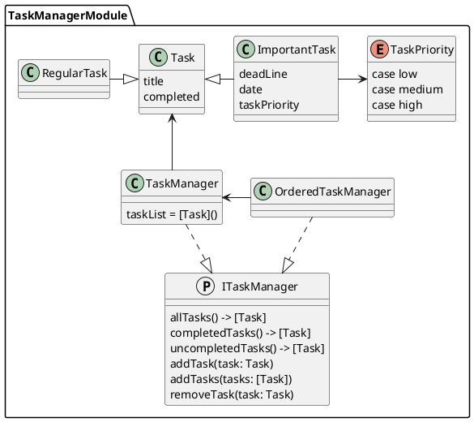

# TaskManagerPackage

The package contains a set of classes for implementing a task list.

Tasks:

- Task – A task, for maintaining a to-do list;
- RegularTask -- A regular task for keeping a to-do list;
- ImportantTask -- Important task with priority for maintaining a to-do list.

Task managers:

- ITaskManager -- Протокол предоставляющий управление списком заданий;
- TaskManager -- Менеджер списка заданий;
- OrderedTaskManager - Менеджер списка заданий, отсортированных по приоритету.

## Описание пакета

Класс `TaskManager`, хранит список заданий и предоставляет функции для управления ими на основе протокола ITaskManager:

- `func allTasks() -> [Task]` -- получение списка всех заданий;
- `func completedTasks() -> [Task]` -- получение списка выполненных заданий;
- `func uncompletedTasks() -> [Task]` -- получение списка невыполненных заданий;
- `func addTask(task: Task)` -- добавление задания в список;
- `func removeTask(task: Task)` -- удаление задания из списка.

`TaskManager` оперирует заданиями -- `Task`, который имеет статус готово (completed) и название (title).

`ImportantTask` поддерживают приоритеты с возможными значениями: `low`, `medium`, `high`. 
А также дату выполнения задания (deadline) в зависимости от ее приоритета. 
Если приоритет установлен в `high`, то дата выполнения устанавливается на следующий день от даты создания задания, 
если в `medium`, то на последующий день, а если в `low`, то на третий день после текущей 
(использован Calendar.current.date).

## UML-схема 



## Installation
### Swift Package Manager
Copy framework url to clipboard:

Open your project in Xcode and go to the "Frameworks, Libraries and Embedded Content" section in the general project settings, then click on the add new library button:

Then select "Add Other..." -> "Add Package Dependency...":

In the window that opens, go to the search bar and paste the url ```  ```
Then press the button "Add Package":

In the package selection window, check the TaskManagerPackage and press "Add Package":

